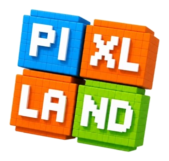
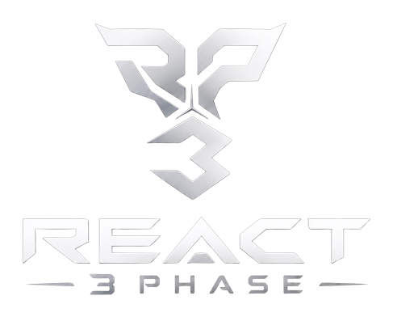
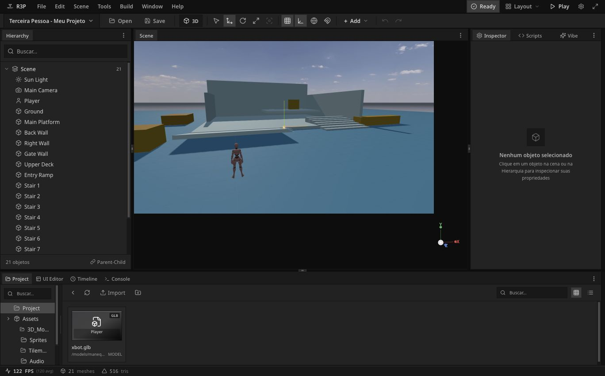
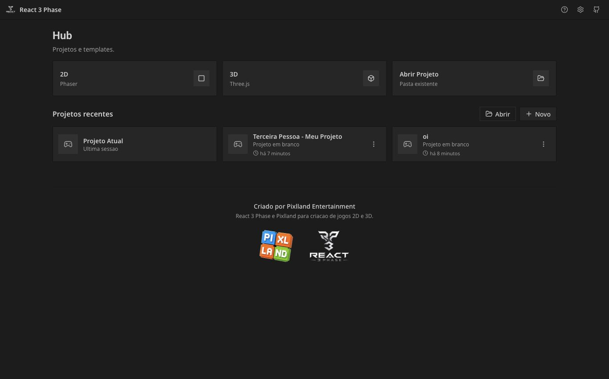

<p align="center">
  
</p>

<h1 align="center">React Three Phase (R3P) - Game Engine 2D/3D WEB</h1>

<p align="center">
  A Pixlland-created, alpha-stage 2D/3D web game engine and editor for building Phaser and Three.js games from one visual workspace.
</p>

<p align="center">
  <strong>Status:</strong> Alpha | <strong>License:</strong> CC BY-NC 3.0 | <strong>Collaboration:</strong> Open to contributors
</p>

<p align="center">
  
</p>

## What This Is

React Three Phase (R3P) is Pixlland Entertainment's non-commercial open-source alpha engine workspace. It combines a desktop-style visual editor, runtime packages, project document tooling, exporters, and agent-facing automation surfaces into one repository.

The goal is to make a lightweight game engine where creators can:

- create 2D games with Phaser;
- create 3D games with Three.js, React Three Fiber, Drei, and Rapier;
- keep scenes, assets, scripts, and build targets in a versioned `.pixlproject` document;
- export playable web builds from the same source of truth;
- let AI coding agents operate through validated CLI, MCP, and engine-ops APIs instead of editing arbitrary files blindly.

This repository is currently in alpha. It is public so developers can study it, test it, report issues, and collaborate, but it is not a finished commercial product.

## Screenshots

### 3D Editor



### Project Hub



## Alpha Status

React Three Phase (R3P) is usable for development experiments and internal Pixlland engine work, but the public API, project schema, editor UX, and export behavior are still changing.

Current alpha capabilities:

- React/Vite visual editor with Unity-like panels, hierarchy, inspector, project browser, scene viewport, play controls, and layout presets.
- 3D scene editing with Three.js, React Three Fiber, Drei helpers, Rapier physics, skybox lighting, player templates, model assets, transform tools, and runtime preview.
- 2D scene direction powered by Phaser 4, with a separate runtime path from 3D exports.
- `.pixlproject` documents for scenes, assets, scripts, runtime metadata, and build targets.
- Local project support through browser folder access where available, with JSON/package fallback flows.
- CLI package for project creation, validation, migration, import/export, and runtime builds.
- MCP package for agent workflows backed by `@pixlland/engine-ops`.
- Sample projects used to validate editor/runtime behavior during alpha.

Known alpha limitations:

- APIs and schemas may break between commits.
- UI labels and older internal docs are still being normalized.
- Desktop packaging exists, but the web editor is still the primary development target.
- Asset licensing and attribution must be checked carefully before using bundled sample assets in external games.
- Commercial use, resale, paid redistribution, or offering the engine as a paid hosted/service product is not allowed under the repository license without written Pixlland permission.

## License

Pixlland publishes this repository for open collaboration under the Creative Commons Attribution-NonCommercial 3.0 Unported license (`CC BY-NC 3.0`).

You may use, study, copy, modify, and share the engine for non-commercial purposes as long as attribution is preserved and the license terms are followed.

You may not sell the engine, sell modified copies, package it as a commercial engine, offer it as a paid hosted service, or use it for commercial advantage without a separate written agreement from Pixlland.

See [LICENSE.md](./LICENSE.md) for the repository license summary and links to the canonical Creative Commons legal code. Third-party assets and vendored references keep their own licenses; see [Third-party assets](./docs/THIRD-PARTY-ASSETS.md).

## Repository Layout

```text
apps/
  studio/                 React/Vite visual editor and desktop shells

packages/
  core/                   .pixl package primitives and shared project IO
  three-runtime/          3D runtime built around Three.js and Rapier
  phaser-runtime/         2D runtime built around Phaser
  ops/                    Validated write surface shared by editor, CLI, and MCP
  cli/                    pixl-engine command line tools
  mcp/                    MCP server for agent workflows

docs/
  assets/                 README brand images and screenshots
  superpowers/            Specs and implementation plans used by agentic work
  *.md                    Architecture notes, ADRs, asset credits, audits

tools/
  vendor/                 Vendored reference code and patched experiments
```

## Tech Stack

- TypeScript, React, Vite, Zustand, Radix UI primitives, and Tailwind-style utility classes.
- Three.js `0.184`, React Three Fiber, Drei, Rapier 2D/3D, and Phaser 4.
- Vitest for package and editor tests.
- Electron and Tauri packaging paths for desktop experiments.
- MCP SDK for agent integration.
- pnpm workspaces for local development.

## Quick Start

Requirements:

- Node.js 18 or newer.
- pnpm 10.33.0 or compatible.

Install dependencies:

```bash
pnpm install
```

Run the Studio editor:

```bash
pnpm dev
```

The dev server is configured for `http://localhost:8080/`.

Run the core validation commands:

```bash
pnpm engine:test
pnpm engine:typecheck
pnpm engine:build
```

## Common Commands

```bash
pnpm dev              # Start the Studio editor
pnpm engine:dev       # Same dev target, explicit engine script
pnpm engine:test      # Run all workspace tests
pnpm engine:typecheck # Type-check all packages and the Studio app
pnpm engine:build     # Build all workspace packages/apps
pnpm engine:lint      # Lint the Studio app
```

Package-level commands are available under each workspace package. For example:

```bash
pnpm --filter @pixlland/engine-cli test
pnpm --filter @pixlland/three-runtime typecheck
pnpm --filter pixlplaygroundstudio electron:dev
pnpm --filter pixlplaygroundstudio tauri:dev
```

## Engine Architecture

React Three Phase (R3P) uses one project document as the coordination layer:

```text
Studio editor
  -> @pixlland/engine-ops
    -> .pixlproject document
      -> 3D runtime / 2D runtime
      -> CLI exports
      -> MCP agent operations
```

Important boundaries:

- The editor owns visual authoring and UX state.
- `@pixlland/engine-ops` owns validated mutations.
- `@pixlland/engine-core` owns package/project primitives.
- `@pixlland/three-runtime` owns 3D runtime behavior.
- `@pixlland/phaser-runtime` owns 2D runtime behavior.
- `@pixlland/engine-cli` and `@pixlland/engine-mcp` expose automation paths for humans and agents.

This separation is intentional: Pixlland wants engine work to stay isolated from individual game repositories and sample game content unless a task explicitly requires game work.

## Build Targets

The alpha build system currently tracks three target directions:

- Three.js web export for 3D projects.
- Phaser web export for 2D projects.
- Pixlland package/build output for Pixlland platform integration.

Readiness checks live in `apps/studio/src/services/buildTargets.ts`, while command-line export behavior lives in `packages/cli` and `packages/ops`.

## Collaboration

Pixlland welcomes collaboration during alpha. The best contributions are focused and easy to validate:

- bug reports with reproduction steps;
- small fixes with tests;
- editor UX improvements that preserve existing workflows;
- runtime improvements with package-level tests;
- docs that clarify current behavior;
- asset/license cleanup;
- agent workflow improvements through CLI, MCP, or engine-ops.

Before contributing, read [CONTRIBUTING.md](./CONTRIBUTING.md). Keep changes scoped to the engine/editor/docs unless a maintainer explicitly asks for sample game or external game repository work.

## Current Priorities

- Stabilize the Unity-like 3D editing workflow.
- Keep the Three.js runtime path reliable in Play Mode.
- Improve project import/export and build readiness checks.
- Normalize English public documentation.
- Expand tests around schema migration, runtime adapters, and build targets.
- Keep third-party asset attribution accurate before wider public use.

## Project Identity

React Three Phase (R3P) is created by Pixlland Entertainment as part of the Pixlland game creation ecosystem. The public alpha repository exists so collaborators can help harden the engine, study the architecture, and build non-commercial experiments while the core design is still evolving.

For commercial licensing, partnership, or permission to sell or host the engine commercially, contact Pixlland for a separate written agreement.
