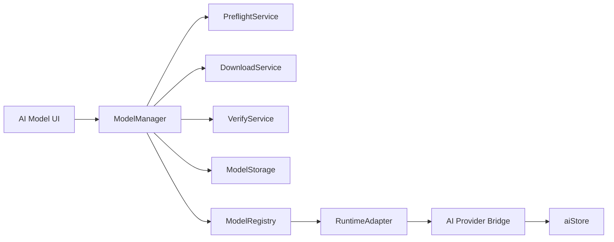

# Local LLM Engine Blueprint (Implementable)

Status: proposed
Owner: engine team
Target: apps/studio + desktop host (electron/tauri)

## 1) Product goal

Allow users to install the engine without AI weights, then optionally download a local LLM from inside the engine and auto-plug it for local inference.

Constraints:
- Optional model download, never bundled in base installer.
- Works in browser runtime and desktop runtime.
- Prefer WebGPU, fallback to WASM/CPU.
- Safe install with checksum validation.
- Compatible with current AI stack in apps/studio/src/services/ai.

## 2) Proposed architecture

Core idea:
- Keep model lifecycle separate from inference provider lifecycle.
- ModelManager owns install/remove/activate.
- WebLLMProvider (or future ONNX provider) consumes active model info from ModelRegistry.

## 3) Services (with responsibilities)

### 3.1 ModelManager
Path: apps/studio/src/services/ai/model-manager/ModelManager.ts

Responsibilities:
- orchestrate preflight -> download -> verify -> register -> activate;
- expose progress events and install status;
- support retry/resume and removal.

Public methods:
- listAvailableModels()
- runPreflight(modelId, variantId)
- install(modelId, variantId)
- activate(modelId, variantId)
- deactivate(modelId, variantId)
- remove(modelId, variantId)

### 3.2 PreflightService
Path: apps/studio/src/services/ai/model-manager/PreflightService.ts

Checks:
- webgpu support;
- fallback wasm availability;
- free disk;
- minimum ram;
- runtime host restrictions (browser/electron/tauri).

Output:
- selectedDevice: webgpu or wasm
- warnings and blocking reasons.

### 3.3 DownloadService
Path: apps/studio/src/services/ai/model-manager/DownloadService.ts

Responsibilities:
- download artifacts with resume;
- chunked streaming;
- emit DownloadProgressEvent;
- cancellation support.

Recommended behavior:
- keep .part files;
- continue from range requests when server supports it;
- checksum only after full artifact is complete.

### 3.4 VerifyService
Path: apps/studio/src/services/ai/model-manager/VerifyService.ts

Responsibilities:
- sha256 validate each artifact;
- return failed artifacts list;
- block activation on mismatch.

### 3.5 ModelStorage
Path: apps/studio/src/services/ai/model-manager/ModelStorage.ts

Responsibilities:
- resolve host-specific model directory;
- atomic file move from temp to final;
- cleanup partial downloads and old versions.

Storage layout:
- models/
  - onnx-community--Qwen3.5-0.8B-ONNX-OPT/
    - q4f16/
      - artifacts...
      - manifest.install.json

### 3.6 ModelRegistry
Path: apps/studio/src/services/ai/model-manager/ModelRegistry.ts

Responsibilities:
- persist active/inactive local models;
- expose active model runtime config;
- keep backward-compatible schema.

Registry file example:
- local-llm-registry.json in app data dir.

### 3.7 RuntimeAdapter
Path: apps/studio/src/services/ai/model-manager/RuntimeAdapter.ts

Responsibilities:
- normalize host-specific features:
  - browser cache path behavior
  - electron fs path and APIs
  - tauri fs path and APIs
- provide runtime + capability info.

## 4) Contracts (already scaffolded)

File: apps/studio/src/services/ai/model-manager/contracts.ts

Provided:
- ModelDescriptor / ModelVariant / ModelArtifact
- ModelInstallRecord
- HostCapabilities + PreflightResult
- LocalModelRuntimeConfig
- ModelManager interface

## 5) Install state machine

File: apps/studio/src/services/ai/model-manager/stateMachine.ts

States:
- not_installed
- queued
- downloading
- verifying
- ready
- failed
- removing

Key transitions:
- not_installed -> queued -> downloading -> verifying -> ready
- downloading/verifying -> failed
- ready/failed -> removing -> not_installed

## 6) Integration with existing AI stack

Current existing components:
- apps/studio/src/services/ai/providers/WebLLMProvider.ts
- apps/studio/src/stores/aiStore.ts

Required integration points:
1. aiStore additions
- localModelInstall: Record<string, ModelInstallRecord>
- installLocalModel(modelId, variantId)
- activateLocalModel(modelId, variantId)
- removeLocalModel(modelId, variantId)

2. Provider boot flow
- before initializeProvider for local provider:
  - resolve active model from ModelRegistry
  - if not installed: show install required state
- pass LocalModelRuntimeConfig into provider constructor.

3. Provider fallback
- if webgpu unavailable and preflight selected wasm:
  - initialize provider with wasm path/device config
  - expose warning in UI (degraded performance).

## 7) Desktop specifics

### 7.1 Electron
- Use app.getPath('userData')/models for storage.
- Keep downloads in main process, emit progress via IPC.
- Renderer only requests install actions and receives status events.

### 7.2 Tauri
- Use app data dir from tauri fs APIs.
- Download and fs operations via Rust commands for reliability.
- Emit progress via Tauri events.

Shared strategy:
- same TypeScript contracts for renderer UI/state;
- host-specific bridge implementation behind RuntimeAdapter.

## 8) Security and reliability

Minimum rules:
- validate sha256 for every artifact;
- never activate unverified model;
- sanitize model ids and file paths;
- do not execute remote code from model metadata;
- explicit user consent for large downloads.

Operational rules:
- retries with exponential backoff;
- cancel support;
- integrity failure triggers automatic cleanup;
- write crash-safe install record after each state step.

## 9) Initial model catalog recommendation

Recommended default for balance:
- modelId: onnx-community/Qwen3.5-0.8B-ONNX-OPT
- variant: q4f16

Reason:
- best balance for local coding assistant use case in this project context.

## 10) Implementation plan (phased)

Phase 1: lifecycle core
- implement ModelManager + Preflight + state machine wiring
- persist install records
- manual activation in dev-only UI

Phase 2: download + verify
- chunked download with resume
- sha256 verification
- stable error handling and retry

Phase 3: provider bridge
- integrate registry resolution into aiStore + provider boot
- auto-plug active model
- fallback device path

Phase 4: desktop bridge
- electron main bridge
- tauri command bridge
- parity tests on mac/windows

## 11) Acceptance criteria

- User can install model from inside app without restarting full app.
- Install survives app restart.
- Corrupted download never activates.
- Local provider can start from active installed model.
- Fallback to wasm works when webgpu is unavailable.
- Remove model frees storage and resets provider status safely.

## 12) Suggested next files

- apps/studio/src/services/ai/model-manager/ModelManager.ts
- apps/studio/src/services/ai/model-manager/PreflightService.ts
- apps/studio/src/services/ai/model-manager/DownloadService.ts
- apps/studio/src/services/ai/model-manager/VerifyService.ts
- apps/studio/src/services/ai/model-manager/ModelStorage.ts
- apps/studio/src/services/ai/model-manager/ModelRegistry.ts
- apps/studio/src/services/ai/model-manager/RuntimeAdapter.ts
- apps/studio/src/stores/aiStore.ts (integration)
- apps/studio/src/components/editor/AIProviderSelector.tsx (UI states/actions)
